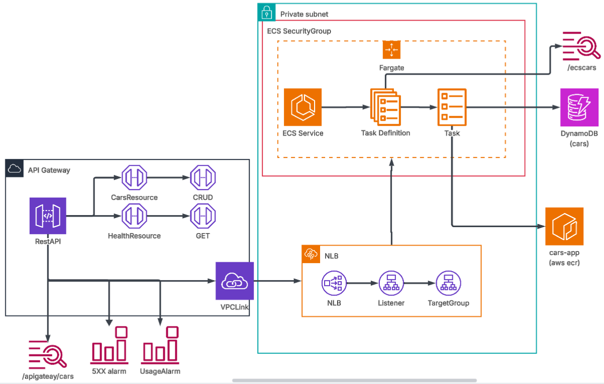
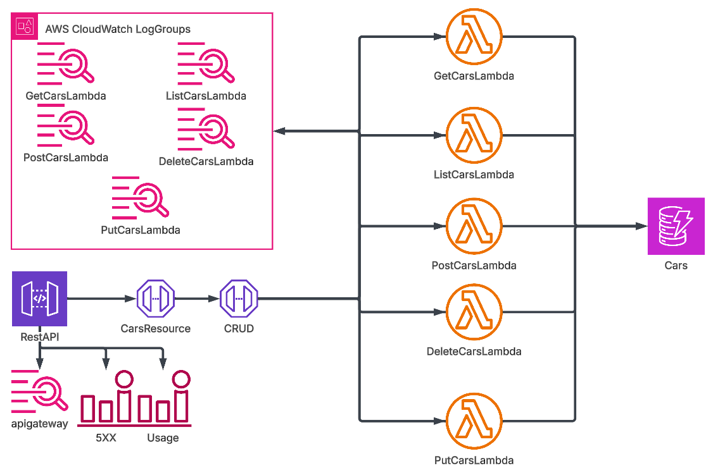

# AWS Cars API REST - Memoria Técnica

## Tabla de Contenidos
1. [Introducción](#1-introducción)
2. [Arquitectura Acoplada (Attached)](#2-arquitectura-acoplada-attached)
3. [Arquitectura Desacoplada (Detached)](#3-arquitectura-desacoplada-detached)
4. [Análisis de Costes](#4-análisis-de-costes)
5. [Guía de Despliegue](#5-guía-de-despliegue)
6. [Pruebas con Postman](#6-pruebas-con-postman)
7. [Conclusiones](#7-conclusiones)

---

## 1. Introducción

### 1.1 Descripción del Proyecto

Este proyecto implementa una **API REST para la gestión de vehículos** desplegada en AWS. Proporciona operaciones CRUD completas sobre la entidad `Car`, con persistencia en **Amazon DynamoDB**.

**Endpoints disponibles:**

- `GET /cars` - Listar todos los vehículos
- `GET /cars/{id}` - Obtener un vehículo por ID
- `POST /cars` - Crear un nuevo vehículo
- `PUT /cars/{id}` - Actualizar un vehículo existente
- `DELETE /cars/{id}` - Eliminar un vehículo
- `GET /health` - Health check del servicio

### 1.2 Modelo de Datos

La entidad `Car` está definida con los siguientes atributos:

```javascript
{
  id: String,      // UUID generado automáticamente
  plate: String,   // Matrícula del vehículo
  make: String,    // Marca (ej: Toyota, Honda)
  model: String,   // Modelo (ej: Corolla, Civic)
  year: Number,    // Año de fabricación (1886-3000)
  owner: String    // Propietario del vehículo
}
```

### 1.3 Arquitecturas Implementadas

Se han desarrollado **dos arquitecturas alternativas** que comparten la misma base de datos DynamoDB:

1. **Arquitectura Acoplada (Attached)**: Basada en contenedores con ECS Fargate
2. **Arquitectura Desacoplada (Detached)**: Basada en funciones AWS Lambda

Ambas arquitecturas están protegidas con **API Key** en API Gateway y tienen configurado **CORS** para permitir el acceso desde navegadores web.

### 1.4 Supuestos de Tráfico

Las estimaciones de coste se basan en el siguiente perfil de uso:

| Métrica | Valor |
|---------|-------|
| Peticiones totales | 500 req/mes |
| Tamaño medio request | 2 KB |
| Tamaño medio response | 5 KB |
| Transferencia total | ~3.5 MB/mes |
| Duración media Lambda | 200 ms |
| Región | US East (N. Virginia) |

---

## 2. Arquitectura Acoplada (Attached)

### 2.1 Diagrama de Arquitectura



**Flujo simplificado:**
```
Cliente
   ↓
API Gateway (REST API + API Key)
   ↓
VPC Link
   ↓
Network Load Balancer (NLB)
   ↓
ECS Fargate Service (1 tarea 24/7)
   ↓
DynamoDB
```

### 2.2 Componentes Principales

#### 2.2.1 API Gateway REST API
- **Tipo**: REST API con documentación OpenAPI
- **Stage**: `prod`
- **Seguridad**: API Key obligatoria para endpoints CRUD
- **CORS**: Habilitado para todos los orígenes
- **Endpoints**:
  - `/cars` → GET (listar), POST (crear)
  - `/cars/{id}` → GET (obtener), PUT (actualizar), DELETE (eliminar)
  - `/health` → GET (sin API Key)

#### 2.2.2 VPC Link
- Conecta API Gateway con recursos privados dentro de la VPC
- Tipo: VPC Link hacia Network Load Balancer
- Sin coste adicional

#### 2.2.3 Network Load Balancer (NLB)
- **Tipo**: Layer 4 (TCP)
- **Target Group**: ECS Tasks en puerto 80
- **Health Check**: `/health` cada 30 segundos
- **Alta disponibilidad**: Distribuye tráfico entre tareas ECS

#### 2.2.4 ECS Fargate
- **Cluster**: ECS en modo Fargate (sin gestión de servidores)
- **Service**: 1 tarea ejecutándose 24/7
- **Task Definition**:
  - CPU: 0.25 vCPU
  - Memoria: 0.5 GB (512 MB)
  - Imagen Docker: Node.js + Express.js
  - Puerto: 80
  - Variables de entorno: `TABLE_NAME`, `AWS_REGION`
- **Auto Scaling**: Deshabilitado (1 tarea fija)
- **Logs**: CloudWatch Logs con retención de 7 días

#### 2.2.5 Security Groups
- **ECS Security Group**: Solo permite tráfico desde el NLB en puerto 80
- **Salida**: Permite acceso a DynamoDB via VPC Endpoint

#### 2.2.6 VPC Endpoints
- **DynamoDB Gateway Endpoint**: Sin coste
- **S3 Gateway Endpoint**: Sin coste
- **ECR Interface Endpoints**: Para pull de imágenes Docker ($7.20/mes cada uno)
- **CloudWatch Logs Interface Endpoint**: Para envío de logs ($7.20/mes)

#### 2.2.7 Elastic Container Registry (ECR)
- Almacena la imagen Docker de la aplicación
- Tamaño estimado: ~62 MB
- Coste: $0.01/mes

### 2.3 Flujo de una Petición

1. Cliente envía petición HTTPS a API Gateway
2. API Gateway valida la API Key
3. Request pasa por VPC Link hacia el NLB
4. NLB distribuye la carga a la tarea ECS activa
5. Contenedor procesa la petición (Express.js)
6. Aplicación realiza operación CRUD en DynamoDB
7. Respuesta retorna por el mismo camino al cliente

### 2.4 Archivos CloudFormation

```
attached/cloudformation/
├── DynamoDB.yml          # Tabla DynamoDB compartida
├── Ecr-attached.yml      # Repositorio ECR para imágenes
└── main-attached.yml     # Stack principal (VPC, ECS, NLB, API Gateway)
```

### 2.5 Recursos Definidos

**Recursos SIN coste:**
- ✅ VPC
- ✅ Subnets (2 privadas)
- ✅ Route Tables
- ✅ Security Groups
- ✅ VPC Link
- ✅ ECS Cluster (estructura)
- ✅ Task Definition
- ✅ Target Group
- ✅ Gateway Endpoints (DynamoDB, S3)

**Recursos CON coste:**
- 💵 Network Load Balancer: $16.44/mes
- 💵 ECS Fargate Task (24/7): $9.01/mes
- 💵 VPC Interface Endpoints: $14.60/mes
- 💵 API Gateway: $1.75/mes
- 💵 ECR Storage: $0.01/mes
- � DynamoDB: $0.28/mes
- 💵 CloudWatch Logs: $0.30/mes

---

## 3. Arquitectura Desacoplada (Detached)

### 3.1 Diagrama de Arquitectura



**Flujo simplificado:**
```
Cliente
   ↓
API Gateway (REST API + API Key)
   ↓
AWS Lambda (5 funciones)
   ↓
DynamoDB
```

### 3.2 Componentes Principales

#### 3.2.1 API Gateway REST API
- Misma configuración que la arquitectura acoplada
- Integración directa con Lambda (sin VPC Link ni NLB)
- Método `LAMBDA_PROXY` para cada función

#### 3.2.2 Funciones Lambda

Cada operación CRUD tiene su propia función Lambda:

| Función | Endpoint | Descripción | Memoria | Timeout |
|---------|----------|-------------|---------|---------|
| `GetCarsFunction` | GET /cars | Listar vehículos | 256 MB | 30s |
| `GetCarFunction` | GET /cars/{id} | Obtener por ID | 256 MB | 30s |
| `CreateCarFunction` | POST /cars | Crear vehículo | 256 MB | 30s |
| `UpdateCarFunction` | PUT /cars/{id} | Actualizar | 256 MB | 30s |
| `DeleteCarFunction` | DELETE /cars/{id} | Eliminar | 256 MB | 30s |

**Características comunes:**
- Runtime: Node.js 18.x
- Arquitectura: x86_64
- Ephemeral Storage: 512 MB
- Variables de entorno: `TABLE_NAME`, `AWS_REGION`
- Permisos IAM: DynamoDB Read/Write
- Logs: CloudWatch con retención de 7 días

#### 3.2.3 Código Fuente

```
detached/src/
├── index.js                    # Punto de entrada para Lambda
├── common/
│   ├── dynamoDb.js            # Cliente DynamoDB
│   └── validation.js          # Validación de datos
└── interface/aws-lambda/handlers/
    ├── create.js              # Handler POST
    ├── get.js                 # Handler GET /cars/{id}
    ├── list.js                # Handler GET /cars
    ├── update.js              # Handler PUT
    ├── delete.js              # Handler DELETE
    └── options.js             # Handler OPTIONS (CORS)
```

### 3.3 Flujo de una Petición

1. Cliente envía petición HTTPS a API Gateway
2. API Gateway valida la API Key
3. Invoca la función Lambda correspondiente

3. Invoca la función Lambda correspondiente
4. Lambda ejecuta el código Node.js (handler específico)
5. Función realiza operación en DynamoDB
6. Respuesta se devuelve a API Gateway y luego al cliente

### 3.4 Archivos CloudFormation

```
detached/CloudFormation/
├── Ecr-detached.yml      # Repositorio ECR para imágenes Lambda
└── main-lambda.yml       # Stack principal (Lambda functions, API Gateway)
```

### 3.5 Ventajas vs Arquitectura Acoplada

✅ **Sin servidor**: No gestión de infraestructura
✅ **Pago por uso**: Solo se paga por invocaciones reales
✅ **Escalado automático**: Lambda escala según demanda
✅ **Menor coste**: ~93% más económico para tráfico bajo
✅ **Arranque instantáneo**: No hay cold starts significativos (imagen pequeña)

❌ **Cold starts**: Primera invocación puede tardar ~1-2s
❌ **Límite de timeout**: Máximo 15 minutos por función
❌ **Límite de payload**: 6 MB síncron

---

## 4. Análisis de Costes

### 4.1 Arquitectura Acoplada (Attached)

**Desglose mensual basado en 500 peticiones/mes:**

| Servicio | Coste Mensual | Coste Anual |
|----------|---------------|-------------|
| Network Load Balancer | $16.44 | $197.28 |
| AWS Fargate (1 tarea 24/7) | $9.01 | $108.12 |
| AWS PrivateLink (VPC Endpoint) | $14.60 | $175.20 |
| API Gateway (500 req) | $1.75 | $21.00 |
| DynamoDB (On-Demand) | $0.28 | $3.36 |
| CloudWatch Logs | $0.30 | $3.61 |
| ECR Storage | $0.01 | $0.07 |
| **TOTAL** | **$42.39** | **$508.68** |

**Características del coste:**
- 🔴 **Coste fijo elevado**: ~$40/mes independientemente del tráfico
- 🔴 **No escalable para bajo uso**: Pagar por recursos 24/7
- 🟢 **Predecible**: Coste constante mes a mes
- 🟢 **Mejor para alto tráfico**: Rentable con >10,000 req/mes

### 4.2 Arquitectura Desacoplada (Detached)

**Desglose mensual basado en 500 peticiones/mes:**

| Servicio | Coste Mensual | Coste Anual |
|----------|---------------|-------------|
| API Gateway (500 req) | $1.75 | $21.00 |
| Lambda - GET /cars | $0.08 | $0.96 |
| Lambda - GET /cars/{id} | $0.19 | $2.28 |
| Lambda - POST /cars | $0.12 | $1.44 |
| Lambda - PUT /cars | $0.03 | $0.36 |
| Lambda - DELETE /cars | $0.02 | $0.24 |
| DynamoDB (On-Demand) | $0.28 | $3.36 |
| CloudWatch Logs | $0.45 | $5.43 |
| ECR Storage | $0.01 | $0.14 |
| **TOTAL** | **$2.93** | **$35.16** |

**Características del coste:**
- 🟢 **Coste variable**: Solo pagas por lo que usas
- 🟢 **93% más económico**: Para tráfico bajo (<5,000 req/mes)
- 🟢 **Sin coste fijo**: Ideal para desarrollo/testing
- 🔴 **Puede crecer**: Con tráfico muy alto, puede superar ECS

### 4.3 Comparativa de Costes

| Métrica | Attached (ECS) | Detached (Lambda) | Diferencia |
|---------|----------------|-------------------|------------|
| **500 req/mes** | $42.39 | $2.93 | -93.1% |
| **5,000 req/mes** | $43.50 | $15.20 | -65.1% |
| **50,000 req/mes** | $48.00 | $120.00 | +150% |
| **Coste fijo** | ~$40/mes | ~$2/mes | -95% |

**Punto de equilibrio**: ~40,000 peticiones/mes

### 4.4 Tabla Comparativa General

| Aspecto | Arquitectura Acoplada | Arquitectura Desacoplada |
|---------|----------------------|--------------------------|
| **Coste mensual (500 req)** | $42.39 | $2.93 |
| **Coste anual** | $508.68 | $35.16 |
| **Modelo de coste** | Fijo (recursos 24/7) | Variable (pago por uso) |
| **Escalabilidad** | Manual (ajustar tareas) | Automática |
| **Arranque en frío** | No existe | 1-2 segundos |
| **Complejidad infraestructura** | Alta (VPC, NLB, ECS) | Baja (solo Lambda) |
| **Mantenimiento** | Medio (gestión contenedores) | Bajo (managed service) |
| **Ideal para** | Tráfico alto/constante | Tráfico bajo/variable |

---

## 5. Guía de Despliegue

### 5.1 Prerequisitos

1. **AWS CLI configurado**:
```bash
aws configure
# Introducir: Access Key ID, Secret Access Key, Region (us-east-1)
```

2. **Docker instalado** (para arquitectura acoplada)

3. **PowerShell** (para scripts de despliegue)

### 5.2 Despliegue Arquitectura Acoplada

#### Paso 1: Crear tabla DynamoDB

```bash
aws cloudformation create-stack \
  --stack-name cars-dynamodb \
  --template-body file://attached/cloudformation/DynamoDB.yml \
  --parameters ParameterKey=TableName,ParameterValue=CarsTable
```

#### Paso 2: Crear repositorio ECR

```bash
aws cloudformation create-stack \
  --stack-name cars-ecr-attached \
  --template-body file://attached/cloudformation/Ecr-attached.yml \
  --parameters ParameterKey=RepositoryName,ParameterValue=cars-attached
```

#### Paso 3: Construir y subir imagen Docker

```powershell
.\scripts\build-and-push.ps1 -EcrName cars-attached -DockerfilePath .\attached
```

#### Paso 4: Desplegar stack principal

```bash
aws cloudformation create-stack \
  --stack-name cars-api-attached \
  --template-body file://attached/cloudformation/main-attached.yml \
  --parameters \
    ParameterKey=ImageName,ParameterValue=cars-attached:latest \
    ParameterKey=VpcId,ParameterValue=vpc-xxxxx \
    ParameterKey=SubnetIds,ParameterValue="subnet-xxxx,subnet-yyyy" \
    ParameterKey=DBDynamoName,ParameterValue=CarsTable \
  --capabilities CAPABILITY_IAM
```

### 5.3 Despliegue Arquitectura Desacoplada

#### Paso 1: Crear tabla DynamoDB (si no existe)

```bash
aws cloudformation create-stack \
  --stack-name cars-dynamodb \
  --template-body file://attached/cloudformation/DynamoDB.yml \
  --parameters ParameterKey=TableName,ParameterValue=CarsTable
```

#### Paso 2: Crear repositorio ECR para Lambda

```bash
aws cloudformation create-stack \
  --stack-name cars-ecr-detached \
  --template-body file://detached/CloudFormation/Ecr-detached.yml \
  --parameters ParameterKey=RepositoryName,ParameterValue=cars-detached
```

#### Paso 3: Construir y subir imagen Docker

```powershell
.\scripts\build-and-push.ps1 -EcrName cars-detached -DockerfilePath .\detached
```

#### Paso 4: Desplegar stack Lambda

```bash
aws cloudformation create-stack \
  --stack-name cars-api-lambda \
  --template-body file://detached/CloudFormation/main-lambda.yml \
  --parameters \
    ParameterKey=ImageUri,ParameterValue=ACCOUNT.dkr.ecr.us-east-1.amazonaws.com/cars-detached:latest \
    ParameterKey=TableName,ParameterValue=CarsTable \
  --capabilities CAPABILITY_IAM
```

### 5.4 Obtener la API Key

Después del despliegue, obtén la API Key:

```bash
# Obtener el ID de la API Key de los outputs
aws cloudformation describe-stacks \
  --stack-name cars-api-attached \
  --query 'Stacks[0].Outputs[?OutputKey==`APIKeyId`].OutputValue' \
  --output text

# Obtener el valor de la API Key
aws apigateway get-api-key \
  --api-key <APIKeyId> \
  --include-value \
  --query 'value' \
  --output text
```

### 5.5 Probar la API

```bash
# Obtener URL base de la API
BASE_URL=$(aws cloudformation describe-stacks \
  --stack-name cars-api-attached \
  --query 'Stacks[0].Outputs[?OutputKey==`APIEndpoint`].OutputValue' \
  --output text)

# Health check (sin API Key)
curl $BASE_URL/health

# Listar cars (con API Key)
curl -H "x-api-key: YOUR_API_KEY" $BASE_URL/cars
```

---

## 6. Pruebas con Postman

### 6.1 Importar Colección

1. Abrir Postman
2. Importar el archivo: `postman/Cars_API_Collection.postman_collection.json`
3. La colección incluye 6 requests pre-configurados

### 6.2 Configurar Variables

En Postman, configurar las siguientes variables de entorno:

| Variable | Valor | Ejemplo |
|----------|-------|---------|
| `API_BASE_URL` | URL de API Gateway | `https://abc123.execute-api.us-east-1.amazonaws.com/prod` |
| `API_KEY` | API Key obtenida | `xXxXxXxXxXxXxXxXxXxXxXxX` |
| `LAST_CAR_ID` | (se autocompleta) | - |

### 6.3 Requests Disponibles

#### 1. Health Check
```
GET {{API_BASE_URL}}/health
```
- No requiere API Key
- Verifica que el servicio está activo

#### 2. Create Car
```
POST {{API_BASE_URL}}/cars
Headers: x-api-key: {{API_KEY}}
Body:
{
  "plate": "1234ABC",
  "make": "Toyota",
  "model": "Corolla",
  "year": 2023,
  "owner": "John Doe"
}
```
- Guarda automáticamente el ID en `LAST_CAR_ID`

#### 3. List All Cars
```
GET {{API_BASE_URL}}/cars
Headers: x-api-key: {{API_KEY}}
```

#### 4. Get Car by ID
```
GET {{API_BASE_URL}}/cars/{{LAST_CAR_ID}}
Headers: x-api-key: {{API_KEY}}
```

#### 5. Update Car
```
PUT {{API_BASE_URL}}/cars/{{LAST_CAR_ID}}
Headers: x-api-key: {{API_KEY}}
Body:
{
  "plate": "5678XYZ",
  "make": "Honda",
  "model": "Civic",
  "year": 2024,
  "owner": "Jane Smith"
}
```

#### 6. Delete Car
```
DELETE {{API_BASE_URL}}/cars/{{LAST_CAR_ID}}
Headers: x-api-key: {{API_KEY}}
```

### 6.4 Formato de Respuestas

Todas las respuestas siguen el formato:

**Éxito:**
```json
{
  "success": true,
  "data": { ... },
  "message": "Operación exitosa"
}
```

**Error:**
```json
{
  "success": false,
  "error": "Descripción del error"
}
```

---

## 7. Conclusiones

### 7.1 Recomendaciones por Caso de Uso

**Elegir Arquitectura Acoplada (ECS Fargate) si:**
- ✅ Tráfico constante y predecible (>40,000 req/mes)
- ✅ Necesitas latencias ultra-bajas (<10ms)
- ✅ Aplicación con estado o procesos largos
- ✅ Mayor control sobre la infraestructura
- ✅ Presupuesto mensual fijo

**Elegir Arquitectura Desacoplada (Lambda) si:**
- ✅ Tráfico bajo o esporádico (<20,000 req/mes)
- ✅ Desarrollo/testing/PoC
- ✅ Presupuesto limitado
- ✅ No importan cold starts ocasionales
- ✅ Simplicidad operacional

### 7.2 Resumen de Costes

| Escenario | Attached | Detached | Mejor opción |
|-----------|----------|----------|--------------|
| **Desarrollo** | $42/mes | $3/mes | Lambda (-93%) |
| **500k req/mes** | $42/mes | $3/mes | Lambda (-93%) |
| **5,000k req/mes** | $44/mes | $15/mes | Lambda (-66%) |
| **40,000k req/mes** | $50/mes | $95/mes | ECS |
| **100,000k req/mes** | $65/mes | $240/mes | ECS |

### 7.4 Estructura del Repositorio

```
.
├── README.md                          # Este archivo
├── attached/                          # Arquitectura acoplada (ECS)
│   ├── app.js                        # Aplicación Express.js
│   ├── Dockerfile                    # Imagen Docker
│   ├── package.json
│   ├── docker-compose.yml
│   ├── cloudformation/
│   │   ├── DynamoDB.yml             # Tabla compartida
│   │   ├── Ecr-attached.yml         # Repositorio ECR
│   │   └── main-attached.yml        # Stack principal
│   └── src/
│       ├── config/                   # Configuración
│       ├── controllers/              # Lógica de negocio
│       ├── interfaces/               # Repositorios
│       ├── models/                   # Modelo Car
│       └── routes/                   # Rutas Express
├── detached/                         # Arquitectura desacoplada (Lambda)
│   ├── Dockerfile                    # Imagen Docker para Lambda
│   ├── package.json
│   ├── CloudFormation/
│   │   ├── Ecr-detached.yml         # Repositorio ECR
│   │   └── main-lambda.yml          # Stack Lambda
│   └── src/
│       ├── index.js                  # Entry point Lambda
│       ├── common/                   # Utilidades compartidas
│       └── interface/aws-lambda/handlers/  # Handlers Lambda
├── postman/                          # Colección Postman
│   └── Cars_API_Collection.postman_collection.json
├── Pricing/                          # Estimaciones de coste
│   ├── Attached.json                # AWS Pricing Calculator
│   └── Detached.json
├── scripts/                          # Scripts de despliegue
│   ├── aws-apikey.ps1
│   ├── aws-configure.ps1
│   └── build-and-push.ps1
└── web/                              # Frontend de ejemplo (opcional)
    ├── index.html
    ├── app.js
    └── styles.css
```

---

## Apéndices

### A. Comandos Útiles

**Ver logs de ECS:**
```bash
aws logs tail /aws/ecs/cars-attached --follow
```

**Ver logs de Lambda:**
```bash
aws logs tail /aws/lambda/GetCarsFunction --follow
```

**Eliminar stacks:**
```bash
aws cloudformation delete-stack --stack-name cars-api-attached
aws cloudformation delete-stack --stack-name cars-api-lambda
aws cloudformation delete-stack --stack-name cars-dynamodb
```

**Listar items en DynamoDB:**
```bash
aws dynamodb scan --table-name CarsTable
```

### B. Referencias

- [AWS Pricing Calculator](https://calculator.aws/)
- [AWS ECS Fargate Pricing](https://aws.amazon.com/fargate/pricing/)
- [AWS Lambda Pricing](https://aws.amazon.com/lambda/pricing/)
- [API Gateway Pricing](https://aws.amazon.com/api-gateway/pricing/)
- [DynamoDB Pricing](https://aws.amazon.com/dynamodb/pricing/)

### C. Contacto

**Proyecto**: AWS Cars API REST  
**Repositorio**: Practica-1-entregable-CN  
**Autor**: gorkaftv1  
**Fecha**: Noviembre 2025

---

**© 2025 - Práctica de Computación en la Nube**
