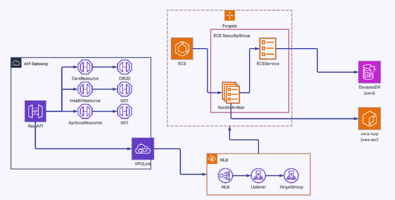
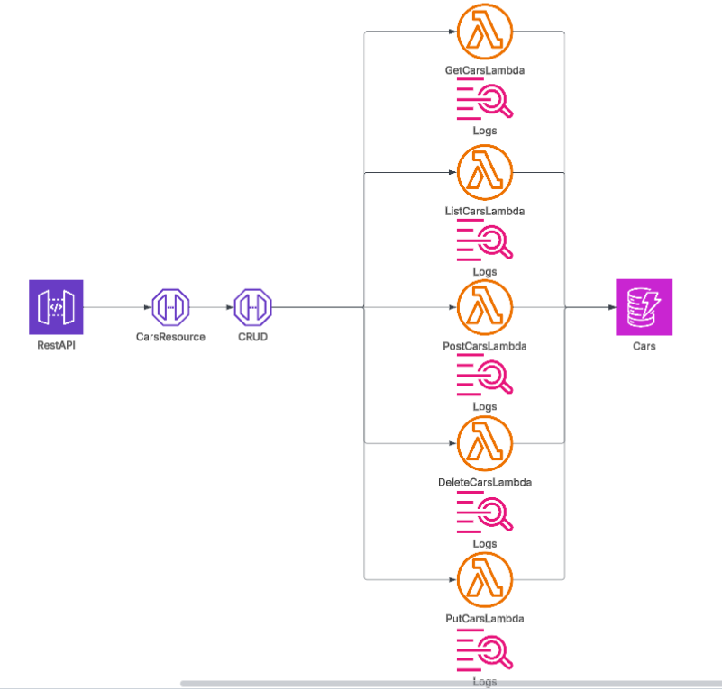

# AWS CARs APIRest

## 1. Introducción / Descripción de la API

Esta aplicación implementa una API REST para la gestión de vehículos (coches). Proporciona las operaciones CRUD sobre la entidad `Car` a través de los endpoints documentados en el repositorio. La persistencia de datos se realiza en Amazon DynamoDB mediante una tabla con atributos simples (ver `api/src/models/Car.js`).

Endpoints disponibles:

- GET /cars — Listado de coches.
- GET /cars/{id} — Obtener un coche por identificador.
- POST /cars — Crear un nuevo coche.
- PUT /cars/{id} — Actualizar un coche existente.
- DELETE /cars/{id} — Eliminar un coche.

En este proyecto se han definido dos alternativas de despliegue que comparten la misma base de datos: una arquitectura acoplada (basada en contenedores/ECS) y una arquitectura desacoplada (basada en funciones Lambda). Las estimaciones de coste en este documento se han realizado con un supuesto de tráfico de referencia: 1.000 llamadas semanales (≈4.000 llamadas/mes).

## 2. Arquitectura Acoplada

### 2.1 Diagrama

<!-- Añadir aquí la imagen del diagrama de la arquitectura acoplada -->

#### TODO

- Revisar el usage plan, y comprobar si sería buena idea poner un límite mensual
- Ruta /api-docs incorrecta, error 403 {
  "success": false,
  "error": "Route not found"
}

### 2.2 Flujo

1. El cliente realiza una petición al endpoint de la API.
2. API Gateway recibe la petición y la enruta al Network Load Balancer (NLB).
3. El NLB distribuye la petición al servicio desplegado en ECS.
4. ECS ejecuta una tarea (ECS Task) que contiene la aplicación y realiza la lógica negocio.
5. La tarea accede a DynamoDB para operaciones CRUD y devuelve la respuesta al cliente a través de API Gateway.

Diagrama de alto nivel del flujo: Cliente → API Gateway → NLB → ECS Service → ECS Task → DynamoDB → Cliente.

### 2.3 Recursos

- API Gateway (configuración de rutas y métodos).
- Network Load Balancer (NLB) para distribución de tráfico.
- VPC link
- ECS Service y ECS Task (Fargate).
- ECR para imágenes docker
- Imagen Docker construida desde `api/Dockerfile`.
- Tabla DynamoDB para persistencia (`api/src/models/Car.js`).
- Plantillas CloudFormation: `api/cloudformation/` (incluye `main.yml`, `ecr.yml`, `dynamodb-only.yml`).

### 2.4 Tabla de precios
#### A Costes básicos
- Llamadas mensuales 5000 
- Tamaño medio de request 2KB(JSON típico)
- Tamaño medio response 5KB(lista corta/recurso individual)
- unos 7KB por request
- 100-200 ms 
- Overhead TCP/IP +20% mas/menos
- Tiempo de ejecución total al mes 13 minutos mas/menos
#### B Estimación
Supuestos principales: 4.000 llamadas/mes; una tarea ECS pequeña en ejecución continua; DynamoDB en modo on-demand o capacidad mínima; moneda EUR.

| Periodo | Coste estimado (EUR) | Comentarios |
|---|---:|---|
| 1 mes | 40 – 120 € | Incluye costes de ECS (Fargate/EC2) y NLB; varía según tamaño de la tarea y si se usa Fargate o EC2. |
| 1 año | 480 – 1.440 € | Proyección anual del rango mensual. |

Notas: el coste puede aumentar si se requieren múltiples tareas en paralelo, mayores recursos CPU/memoria o mayor transferencia de datos saliente.

## 3. Arquitectura Desacoplada

### 3.1 Diagrama

<!-- Añadir aquí la imagen del diagrama de la arquitectura desacoplada -->

*(Reemplace la ruta de la imagen por la que corresponda.)*
#### TODO

- Añadir quota mensual de unas 5000 llamadas mensuales, para que no cobren de más

### 3.2 Flujo

1. El cliente realiza una petición al endpoint de la API.
2. API Gateway recibe la petición y la invoca directamente a la función Lambda correspondiente.
3. La función Lambda ejecuta la lógica CRUD y accede a DynamoDB para persistir o leer datos.
4. Lambda devuelve la respuesta a API Gateway y esta la entrega al cliente.

Diagrama de alto nivel del flujo: Cliente → API Gateway → Lambda → DynamoDB → Cliente.

### 3.3 Recursos

- API Gateway (endpoints y métodos).
- Funciones AWS Lambda (handlers en `deacoplated/src/interface/aws-lambda/handlers/`). Con timeouts de 30 segundos y una memoria de 256 Mb 
- LogsGroups para cada Lambda, con retención de 7 días
- DynamoDB (tabla compartida con la arquitectura acoplada).
- Código y utilidades: `deacoplated/src/common/`.
- Plantillas CloudFormation: `deacoplated/CloudFormation/`.

### 3.4 Tabla de precios 
#### A Costes básicos

#### B Estimación
Supuestos principales: 4.000 invocaciones/mes; funciones Lambda con memoria 128–256 MB y duración media corta (<200 ms); DynamoDB en modo on-demand o baja capacidad provisionada; moneda EUR.

| Periodo | Coste estimado (EUR) | Comentarios |
|---|---:|---|
| 1 mes | 6 – 25 € | Coste dominado por invocaciones de Lambda y consumo de DynamoDB; para bajo uso es significativamente más económico que la opción acoplada. |
| 1 año | 72 – 300 € | Proyección anual del rango mensual. |

Notas: el coste puede incrementarse si las funciones requieren mayor memoria, mayor duración media o si hay un volumen de salida de datos significativo.

## 4. Conclusión

## 5. USO

| Concepto                              | Valor estimado                           | Comentario                                         |
| :------------------------------------ | :--------------------------------------- | :------------------------------------------------- |
| **Llamadas a la API**                 | 4.000 / mes                              | 1.000 semanales aprox.                             |
| **Tamaño medio request**              | 2 KB                                     | JSON con campos simples (marca, modelo, año, etc.) |
| **Tamaño medio response**             | 5 KB                                     | Respuesta con objeto o lista corta                 |
| **Transferencia total**               | 4.000 × (2 + 5) KB ≈ **28 MB/mes**       | Datos de entrada y salida                          |
| **Duración media ejecución**          | 150–200 ms                               | Para operaciones CRUD ligeras                      |
| **CPU utilizada (Lambda o ECS Task)** | 0.25–0.5 vCPU                            | Carga baja                                         |
| **Memoria utilizada**                 | 128–256 MB                               | Configuración típica mínima                        |
| **Tiempo total de ejecución**         | (4.000 × 0.2 s) = **800 s ≈ 13 min/mes** | Suma total de tiempo activo                        |
| **Región de despliegue**              | `eu-west-1 (Irlanda)`                    | Región más cercana a España                        |
| **Tipo de uso**                       | Desarrollo / tráfico bajo                | Sin picos de concurrencia altos                    |

| Recurso                         | Unidad de medida    | Valor estimado                      | Comentario                           |
| :------------------------------ | :------------------ | :---------------------------------- | :----------------------------------- |
| **ECS Task (Fargate)**          | Horas activas       | 730 h/mes (1 tarea activa 24/7)     | 1 vCPU + 1 GB o 0.25 vCPU + 0.5 GB   |
| **Network Load Balancer (NLB)** | Horas activas       | 730 h/mes                           | Enrutamiento continuo                |
| **Data Processed by NLB**       | GB/mes              | ~0.03 GB                            | Basado en tráfico total estimado     |
| **API Gateway (REST API)**      | Requests/mes        | 4.000                               | Invocaciones desde el cliente        |
| **DynamoDB (On-Demand)**        | Lecturas/escrituras | ~8.000 operaciones (≈2 por request) | CRUD básico: 1 lectura + 1 escritura |
| **Storage DynamoDB**            | GB                  | < 1 GB                              | Tabla ligera (< 1 000 items)         |

| Concepto                         | Valor estimado                                                                                         | Comentario                                |
| :------------------------------- | :----------------------------------------------------------------------------------------------------- | :---------------------------------------- |
| **Total de peticiones/mes**      | 4.000                                                                                                  | Promedio 1.000 por semana                 |
| **Distribución por endpoint**    | `GET /cars` 40%, `GET /cars/{id}` 25%, `POST /cars` 15%, `PUT /cars/{id}` 10%, `DELETE /cars/{id}` 10% | Reparto típico CRUD                       |
| **Duración media por Lambda**    | 0.2 s                                                                                                  | CRUD simple sobre DynamoDB                |
| **Memoria asignada**             | 256 MB (0.25 GB)                                                                                       | Definida en CloudFormation                |
| **Región de referencia**         | `eu-west-1 (Irlanda)`                                                                                  | Más cercana a España                      |
| **Volumen de datos por request** | ~7 KB (2 KB request + 5 KB response)                                                                   | Datos JSON simples                        |
| **Datos totales transferidos**   | 4.000 × 7 KB ≈ **28 MB/mes**                                                                           | Despreciable frente a mínimos facturables |

